# O que é um portfólio?

-   Um portfólio é um espaço onde você organiza e apresenta seus projetos, análises e trabalhos de forma prática e profissional.

-   Enquanto o currículo descreve o que você sabe, o portfólio mostra como realmente você consegue construir.

## **Na área de dados, ele pode reunir:**

-   análises;

-   gráficos;

-   dashboards;

-   relatórios;

-   projetos em R, Python e muito mais;

-   aplicações;

-   artigos e estudos técnicos.

> Além de demonstrar **conhecimento técnico**, o portfólio ajuda a **comunicar** sua forma de **pensar**, **resolver problemas** e **estruturar projetos**.

# Por que você precisa de um portfólio

-   Saber fazer é importante.

-   Conseguir mostrar o que você sabe fazer é o que torna esse conhecimento visível para oportunidades.

> **O portfólio funciona exatamente nesse ponto:** ele transforma projetos, análises e resultados em evidências concretas do seu trabalho.

-   Mais do que uma vitrine, é uma forma **objetiva de comunicar capacidade técnica**, **organização** e **experiência prática** em áreas como dados, estatística, programação e pesquisa.

## Para a academia

-   Pesquisadores desenvolvem análises, metodologias e resultados que frequentemente ficam restritos a artigos, apresentações e dissertações.

-   Um portfólio técnico amplia a visibilidade desse trabalho e cria uma ponte entre pesquisa, aplicação e comunicação científica.

    > **Além de centralizar projetos, scripts e relatórios, o portfólio fortalece princípios fundamentais da ciência moderna, como reprodutibilidade, transparência e compartilhamento do conhecimento.**

-   É o espaço onde métodos, análises e resultados deixam de existir apenas no texto científico e passam a ser apresentados de forma acessível, organizada e reutilizável.

## Para quem está em transição

-   Mudanças de área, cargo ou setor geralmente trazem o mesmo desafio: **demonstrar competência em um contexto onde ainda não existe histórico profissional consolidado.**

-   **O portfólio ajuda a reduzir essa distância.**

-   Ele permite mostrar projetos, estudos e soluções desenvolvidas na prática, mesmo antes da primeira oportunidade formal na nova área. Em vez de depender apenas de experiências anteriores, você passa a apresentar evidências do que já consegue construir, analisar e resolver.

-   Isso torna a transição mais estratégica, objetiva e visível.

# Pré-requisitos para iniciarmos

## 1. Instalação do R no Windows

-   O R é a l**`inguagem de programação base`**.

-   O Quarto executa o código R durante a renderização dos documentos.

-   **Acesse o site oficial do CRAN: <https://cran.r-project.org>**

    1.  Clique em **Mirrors** → **0-Cloud** → **Download R for Windows** → **base** → **Download R-4.5.3 for Windows**
    2.  Salve o instalador em uma pasta de sua preferência
    3.  Dê duplo clique no arquivo baixado para iniciar a instalação
    4.  Mantenha as **configurações padrão** - clique em "Avançar" até concluir

## 2. RStudio ou Positron

**Você precisa de um ambiente de desenvolvimento para escrever e renderizar os arquivos `.qmd`. As duas opções recomendadas são:**

| Ferramenta | Quando usar |
|------------------------------------|------------------------------------|
| **RStudio** | Recomendado para quem trabalha principalmente com R. Interface consolidada, integração nativa com Quarto. |
| **Positron** | Nova IDE da Posit, multilinguagem (R e Python). Interface mais moderna. Boa opção para quem também usa Python. |

**RStudio:** <https://posit.co/download/rstudio-desktop>

**Positron:** <https://github.com/posit-dev/positron/releases>

::: callout-note
## Nesta playlist

Os vídeos serão gravados no RStudio.

Se você usar o Positron, a lógica é a mesma apenas a interface visual difere.
:::

## Instalando o RStudio no Windows {#sec-instalar-rstudio}

1.  Acesse o site oficial da Posit: <https://posit.co/download/rstudio-desktop/>

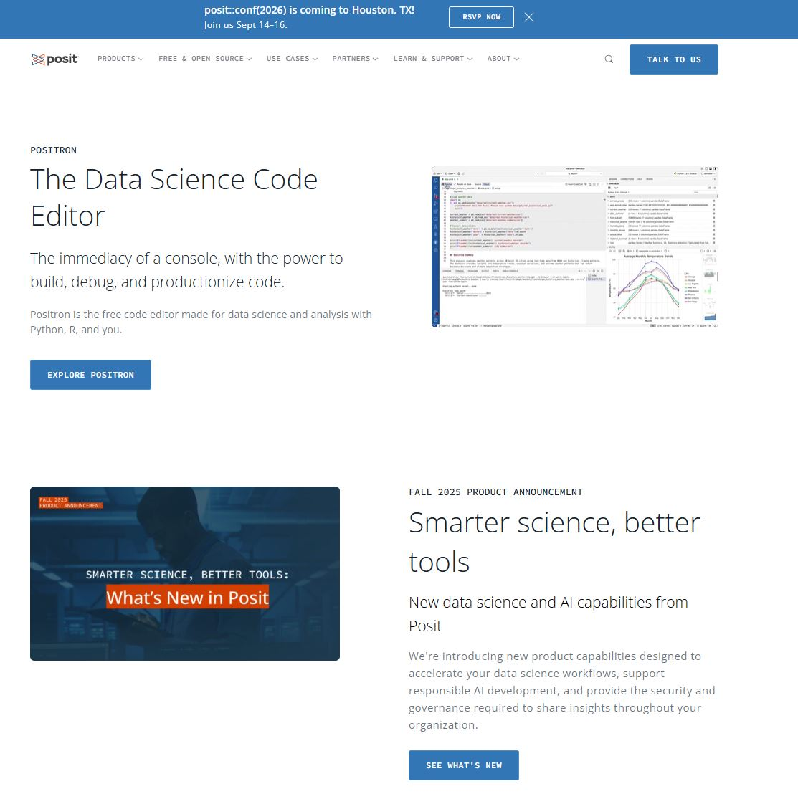{fig-align="center"}

2.  Clique em **Install RStudio**

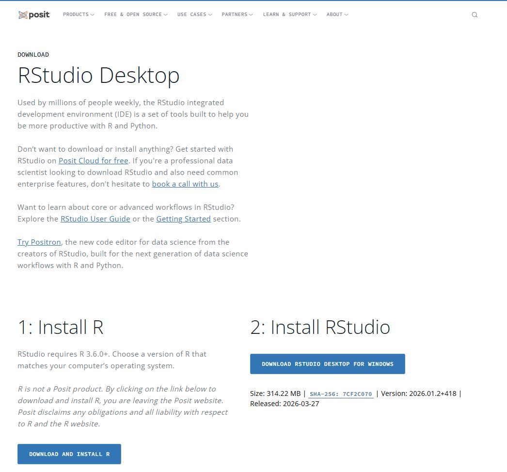{fig-align="center"}

3.  **Escolha a versão compatível com o seu sistema operacional (Windows 64-bit)**

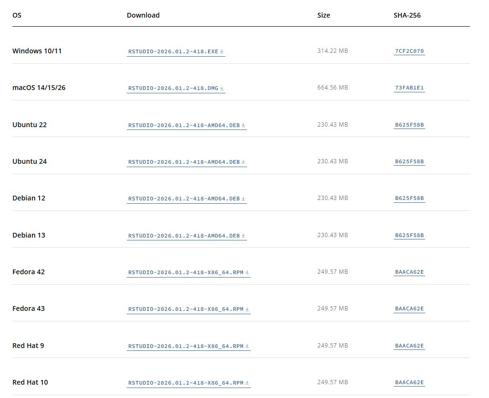{fig-align="center"}

4.  Baixe o instalador e dê duplo clique para iniciar
5.  Mantenha as **configurações padrão** - clique em "Avançar" até concluir
6.  Após instalar, localize o ícone do RStudio e abra o programa

## 3. Quarto CLI

-   O Quarto CLI é o componente responsável pela renderização dos documentos.

-   Sem ele, o botão **Render** no RStudio não funciona.

-   **Download:** <https://quarto.org/docs/get-started>

-   Acesse o site, baixe o instalador para o seu sistema operacional e instale com as configurações padrão.

-   Assim, após a instalação o RStudio já identificará o Quarto.

**Após a instalação, verifique no terminal do RStudio:**

``` bash
quarto --version
```

**Se o número da versão aparecer, a instalação foi concluída corretamente.**

::: callout-tip
## Versão mínima recomendada

Quarto 1.4 ou superior. A versão mais recente disponível no site é sempre a mais estável.
:::

[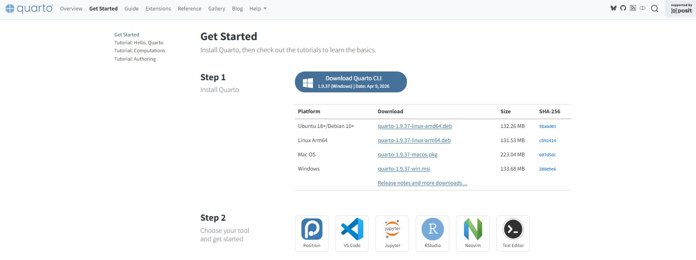{fig-align="center"}](https://quarto.org/docs/get-started/)

# Posit

-   A Posit é a empresa responsável pelo RStudio, pelo Quarto e por grande parte do ecossistema open source que usamos nesta playlist.

-   Conhecer o que ela representa ajuda a entender de onde vêm as ferramentas e para onde elas estão indo.

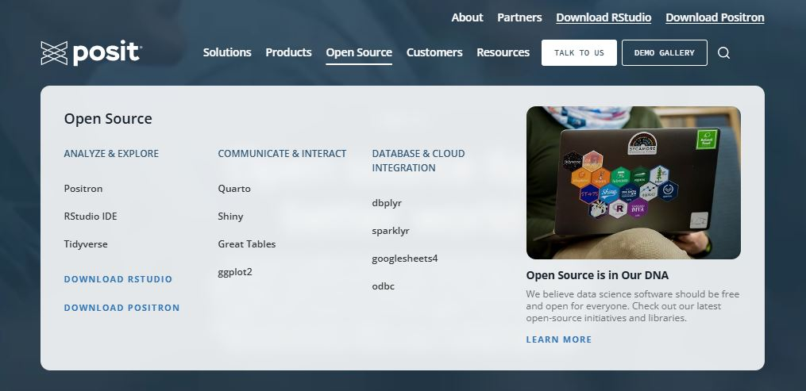{fig-align="center"}

### Código aberto para um mundo melhor

**"A Posit cria softwares excepcionais que ajudam indivíduos, equipes e organizações a compreender e tomar melhores decisões com base em dados. Acreditamos que as análises devem ser corretas, transparentes e reproduzíveis, e que as melhores análises exigem a colaboração entre humanos e IA. Nosso objetivo é ajudar a resolver os problemas mais importantes da nossa época com dados, e queremos auxiliar todos que trabalham nessas soluções, independentemente de seus recursos."**

# Roteiro da playlist

Esta apostila acompanha os 12 vídeos da playlist **"Do zero ao site no ar"**. Abaixo está o mapa completo do que será construído em cada etapa.

| Vídeo | Título | O que acontece |
|------------------------|------------------------|------------------------|
| V01 | Por que você precisa de um portfólio | Contexto e motivação |
| V02 | Instalando R, RStudio e Quarto | Ambiente configurado e pronto |
| V03 | O que é o Quarto e os tipos de output | Entender a ferramenta antes de usar |
| V04 | YAML: o cabeçalho que controla tudo | Configurar o documento corretamente |
| V05 | Chunks de código: opções essenciais | Controlar como o código aparece no output |
| V06 | Markdown e formatação | Escrever o conteúdo do site |
| V07 | Temas e personalização visual | Dar identidade ao site |
| V08 | Criando o site com Quarto | Projeto criado, estrutura no lugar |
| V09 | Posts e categorias | Primeiro post publicado localmente |
| V10 | Personalizando navegação e aparência | site com identidade visual definida |
| V11 | Publicando no Quarto Pub | site no ar com URL pública |
| V12 | Publicando no Netlify | site com domínio personalizado |

::: callout-note
## Produto final

Ao concluir a playlist, você terá um site técnico publicado, com pelo menos um post, acessível por URL pública e pronto para receber o primeiro projeto na segunda playlist.
:::

# O que é o Quarto

-   O Quarto é um sistema de publicação científica e técnica de código aberto mantido pela **`Posit`**.

-   Ele permite combinar texto, código e resultados em um único arquivo `.qmd` e gerar diferentes formatos de saída: **`documentos`**, **`apresentações`**, **`sites`**, **`blogs`** e **`livros`**.

**É a evolução do R Markdown, com suporte a R, Python, Julia e Observable.**

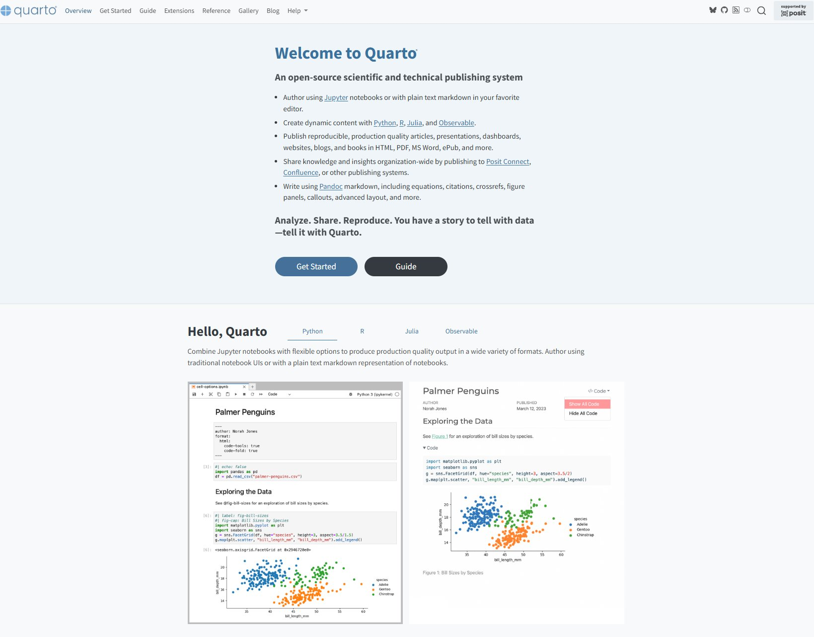

**Acesse aqui:** <https://quarto.org>

## O que o Quarto gera?

::: panel-tabset
### Documentos

| Formato | Uso                                      |
|---------|------------------------------------------|
| HTML    | Apostilas, relatórios online, portfólios |
| PDF     | Documentos formais e impressos           |
| MS Word | Compatibilidade com fluxos corporativos  |

[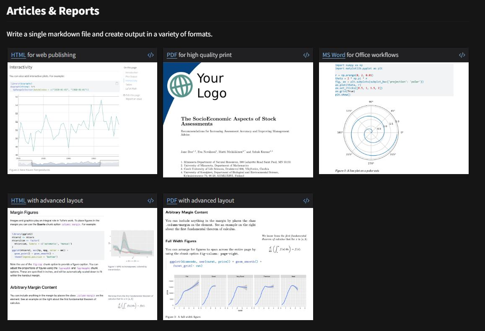{fig-align="center"}](https://quarto.org/docs/gallery/#articles-reports)

### Apresentações

| Formato    | Uso                               |
|------------|-----------------------------------|
| Reveal.js  | Apresentações interativas em HTML |
| PowerPoint | Compatibilidade com Office        |
| Beamer     | Apresentações acadêmicas em LaTeX |

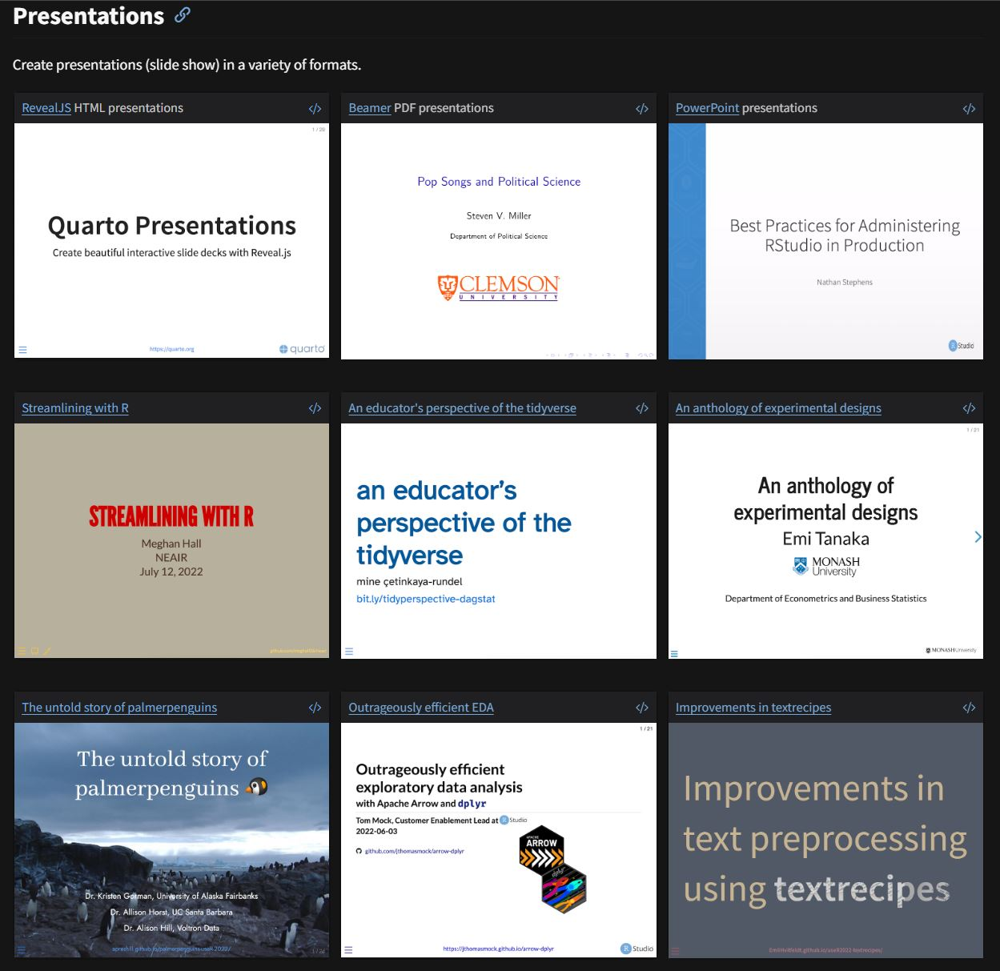{fig-align="center"}

### Sites e Blogs

| Formato | Uso                                    |
|---------|----------------------------------------|
| Website | Site com múltiplas páginas             |
| Blog    | Posts organizados por data e categoria |
| Livro   | Conteúdo longo com capítulos           |

[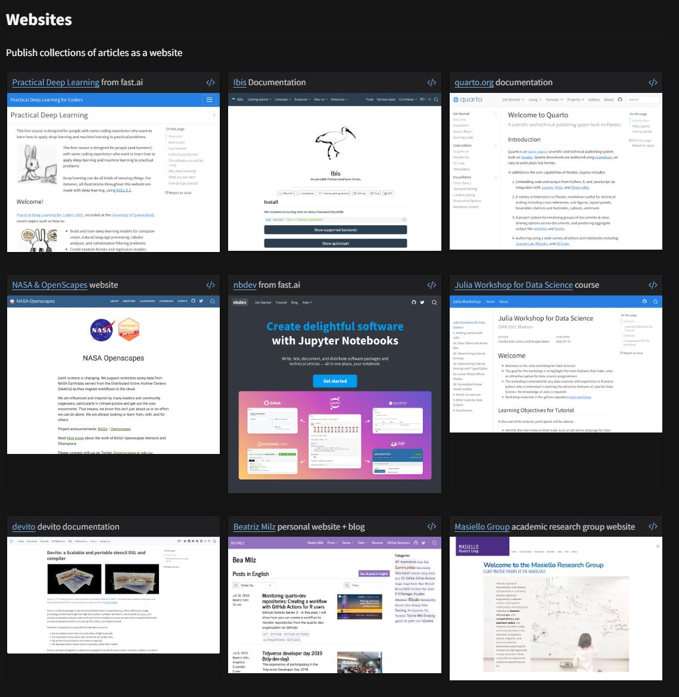{fig-align="center"}](https://quarto.org/docs/gallery/#websites)

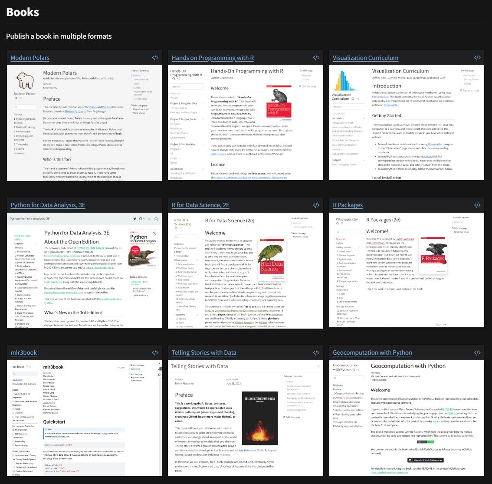{fig-align="center"}
:::

## Onde encontrar tudo no Quarto?

**O site oficial tem três seções que você vai consultar ao longo da playlist:**

-   **Guide** - documentação completa por tipo de output e funcionalidade.

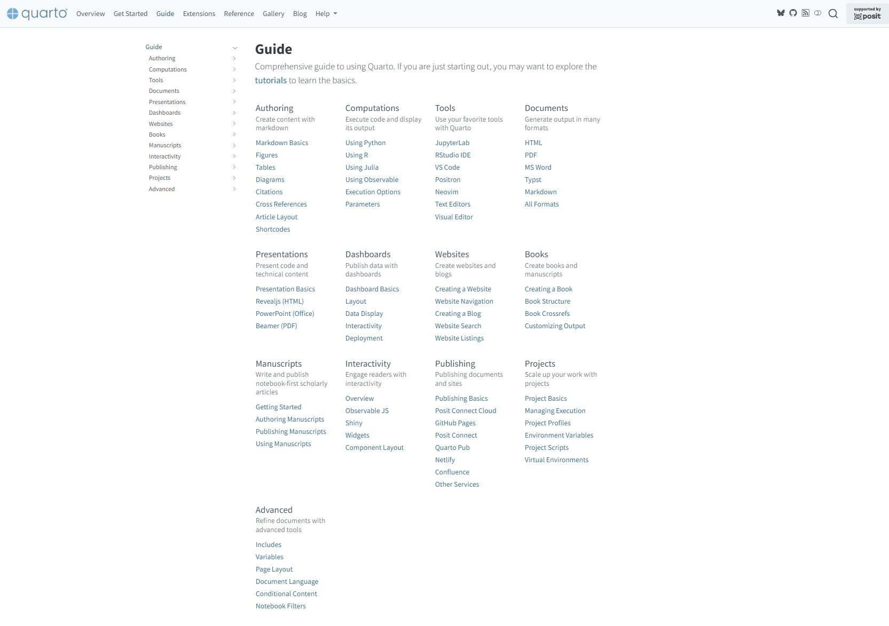

<https://quarto.org/docs/guide/>

-   **Reference** - referência técnica de todas as opções de YAML, chunks e projeto.

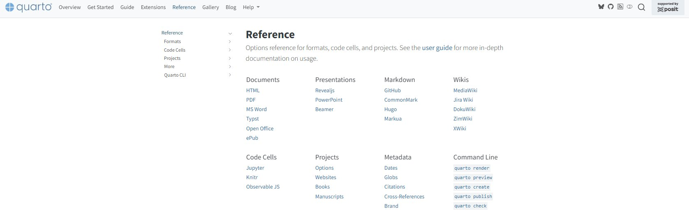

<https://quarto.org/docs/reference/>

-   **Gallery** - exemplos reais de sites, blogs, apresentações e livros construídos com Quarto.

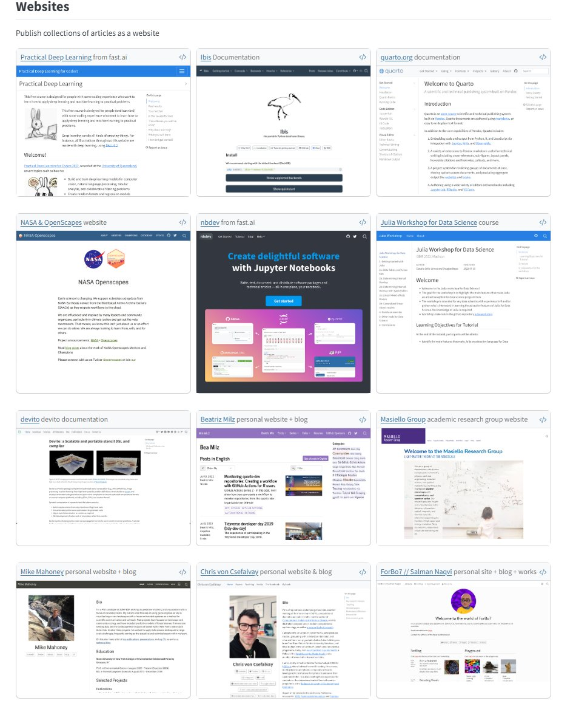

<https://quarto.org/docs/gallery/#websites>

# O que você precisa saber antes de criar o site

**Todo arquivo `.qmd` tem três componentes. Você não precisa dominar cada um agora, mas precisa reconhecê-los.**

## 1. YAML

-   O `YAML` é o cabeçalho do documento.

-   Fica entre `---` no início do arquivo e define o formato, o tema, o sumário e o comportamento do código.

``` yaml
---
title: "Meu site"
author: "Jennifer Lopes"
date: today
lang: pt
format:
  html:
    toc: true
    theme: cosmo
execute:
  warning: false
  message: false
---
```

::: callout-warning
## Atenção

-   O **`YAML`** usa dois espaços por nível de indentação.

-   Nunca use tabulação. Erros de indentação impedem a renderização.
:::

## 2. Chunks de código

-   **`Chunks`** são blocos onde o código é executado.

-   O resultado aparece automaticamente no documento renderizado.

-   As opções mais usadas:

| Opção              | O que faz                             |
|--------------------|---------------------------------------|
| `echo: false`      | Oculta o código, mostra o resultado   |
| `eval: false`      | Mostra o código, não executa          |
| `include: false`   | Executa mas não mostra nada no output |
| `warning: false`   | Oculta avisos                         |
| `fig-cap: "texto"` | Adiciona legenda à figura             |

## 3. Markdown

-   **O texto do documento é escrito em Markdown.**

-   **O essencial para o** site**:**

| Sintaxe           | Resultado       |
|-------------------|-----------------|
| `## Título`       | Título de seção |
| `**negrito**`     | **negrito**     |
| `*itálico*`       | *itálico*       |
| `[texto](url)`    | link            |
| `` | imagem          |

-   **Callouts** para destacar informações:

``` markdown
::: {.callout-note}
Informação adicional.
:::

::: {.callout-warning}
Algo que merece atenção.
:::

::: {.callout-tip}
Recomendação prática.
:::
```

# Criando o site

## Novo projeto no RStudio

-   **File \> New Project \> New Directory \> Quarto website**

-   O RStudio gera a estrutura inicial automaticamente:

```         
meu-site/
├── _quarto.yml       ← configuração central do projeto
├── index.qmd         ← página inicial com listagem de posts
├── about.qmd         ← página sobre
├── posts/            ← pasta dos posts
│   ├── post-01/
│   │   └── index.qmd
│   └── post-02/
│       └── index.qmd
└── styles.css        ← estilo customizado
```

## O arquivo `_quarto.yml`

-   O `_quarto.yml` é o centro de controle do site.

-   Tudo definido aqui se aplica a todas as páginas.

``` yaml
project:
  type: website

website:
  title: "Café com R"
  description: "Ciência de dados com R"
  navbar:
    right:
      - about.qmd
      - icon: github
        href: https://github.com/JenniferLopes
      - icon: linkedin
        href: https://linkedin.com/in/jennifer-luz-lopes
  page-footer:
    center: "Café com R - Jennifer Lopes"

format:
  html:
    theme: cosmo
    css: styles.css
    toc: true
```

## Criando um post

-   Cada post é um arquivo `index.qmd` dentro de uma subpasta em `posts/`.

-   O YAML do post define os metadados que aparecem na listagem:

``` yaml
---
title: "Meu primeiro post"
author: "Jennifer Lopes"
date: "2026-04-23"
categories: [R, tutorial]
description: "Uma análise exploratória com dados reais."
image: capa.png
---
```

**O conteúdo vem abaixo do YAML, escrito em Markdown com chunks de código quando necessário.**

## Listagem automática de posts

-   A página `index.qmd` usa o tipo `listing` para gerar o índice automaticamente a partir dos metadados de cada post:

``` yaml
---
title: "Blog"
listing:
  contents: posts
  sort: "date desc"
  type: default
  categories: true
---
```

**O Quarto lê os metadados de cada post e monta a página. Nenhum código adicional é necessário.**

## Temas e personalização

Troca de tema em uma linha no `_quarto.yml`:

``` yaml
format:
  html:
    theme: flatly
```

-   Temas disponíveis: `cosmo`, `flatly`, `darkly`, `lumen`, `journal`, `sandstone`, `minty`, `united`, `yeti`, entre outros.

-   **Para ir além dos temas prontos, edite o `styles.css` e referencie no YAML:**

``` yaml
format:
  html:
    theme: cosmo
    css: styles.css
```

# Publicando o blog

**O Quarto oferece múltiplas plataformas. Nesta playlist serão usadas Quarto Pub e Netlify.**

| Plataforma | Características                                               |
|------------------------------------|------------------------------------|
| Quarto Pub | Gratuito, publicação com um comando, sem configuração         |
| Netlify    | Domínio customizado, mais controle, plano gratuito disponível |

[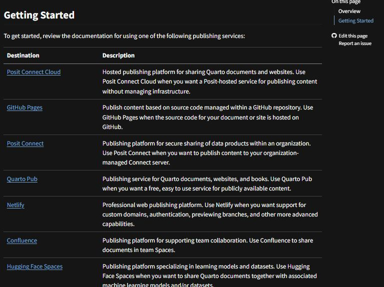{fig-align="center"}](https://quarto.org/docs/publishing/)

## Quarto Pub

-   **Serviço de publicação gratuito da Posit, ideal para começar.**

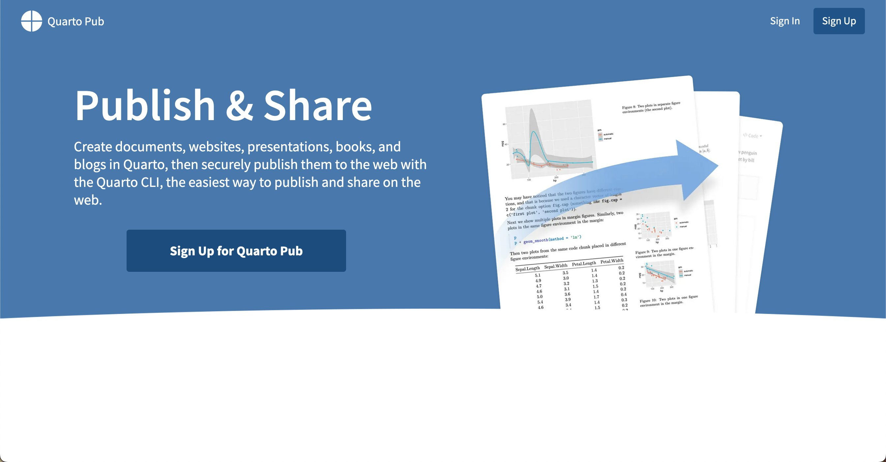

<https://quartopub.com>

**Publicar:**

``` bash
quarto publish quarto-pub
```

-   **Na primeira execução, o terminal abre o navegador para autenticação.**

-   **Nas seguintes, basta rodar o comando novamente.**

-   **O site fica disponível em: `usuario.quarto.pub/nome-do-projeto`**

## Netlify

**Plataforma de hospedagem web com plano gratuito.**

**Via terminal:**

``` bash
quarto publish netlify
```

**Via upload manual:**

1.  Renderizar o projeto: `quarto render`
2.  Criar conta em [netlify.com](https://netlify.com)
3.  Arrastar a pasta `_site/` para o painel do Netlify
4.  O blog é publicado e uma URL gerada

O site fica disponível em: `nome-escolhido.netlify.app`

# Referências

| Recurso | Link |
|------------------------------------|------------------------------------|
| Site do Quarto | [quarto.org](https://quarto.org) |
| Guia completo | [quarto.org/docs/guide](https://quarto.org/docs/guide/) |
| Referência técnica | [quarto.org/docs/reference](https://quarto.org/docs/reference/) |
| Galeria | [quarto.org/docs/gallery](https://quarto.org/docs/gallery/) |
| Temas HTML | [quarto.org/docs/output-formats/html-themes](https://quarto.org/docs/output-formats/html-themes.html) |
| Publicação no Quarto Pub | [quarto.org/docs/publishing](https://quarto.org/docs/publishing/) |
| Publicação no Netlify | <https://www.netlify.com/> |

# Acesse os materiais disponíveis

```{=html}

<div style="
display:flex;
flex-direction:column;
gap:12px;
padding:1rem 0;
max-width:420px;
margin:auto;
">

  <!-- Blog -->
  <a href="https://jenniferlopes.quarto.pub/portifolio/" 
     target="_blank"
     style="
     display:flex;
     align-items:center;
     gap:14px;
     background:#224573;
     padding:14px 22px;
     text-decoration:none;
     border-radius:8px;
     transition:0.2s ease;
     ">

    <svg xmlns="http://www.w3.org/2000/svg"
         width="20"
         height="20"
         viewBox="0 0 24 24"
         fill="none"
         stroke="#ffffff"
         stroke-width="2"
         stroke-linecap="round"
         stroke-linejoin="round">
      <path d="M4 19.5A2.5 2.5 0 0 1 6.5 17H20"/>
      <path d="M6.5 2H20v20H6.5A2.5 2.5 0 0 1 4 19.5v-15A2.5 2.5 0 0 1 6.5 2z"/>
    </svg>

    <span style="
    font-size:15px;
    font-weight:600;
    color:#ffffff;
    flex:1;
    ">
      Blog Café com R
    </span>

    <svg xmlns="http://www.w3.org/2000/svg"
         width="16"
         height="16"
         viewBox="0 0 24 24"
         fill="none"
         stroke="#ffffff"
         stroke-width="2"
         stroke-linecap="round"
         stroke-linejoin="round">
      <line x1="5" y1="12" x2="19" y2="12"/>
      <polyline points="12 5 19 12 12 19"/>
    </svg>
  </a>

  <!-- GitHub -->
  <a href="https://github.com/JenniferLopes"
     target="_blank"
     style="
     display:flex;
     align-items:center;
     gap:14px;
     background:#6B4F4F;
     padding:14px 22px;
     text-decoration:none;
     border-radius:8px;
     ">

    <svg xmlns="http://www.w3.org/2000/svg"
         width="20"
         height="20"
         viewBox="0 0 24 24"
         fill="#ffffff">
      <path d="M12 0C5.37 0 0 5.37 0 12c0 5.31 3.435 9.795 8.205 11.385.6.105.825-.255.825-.57 0-.285-.015-1.23-.015-2.235-3.015.555-3.795-.735-4.035-1.41-.135-.345-.72-1.41-1.23-1.695-.42-.225-1.02-.78-.015-.795.945-.015 1.62.87 1.845 1.23 1.08 1.815 2.805 1.305 3.495.99.105-.78.42-1.305.765-1.605-2.67-.3-5.46-1.335-5.46-5.925 0-1.305.465-2.385 1.23-3.225-.12-.3-.54-1.53.12-3.18 0 0 1.005-.315 3.3 1.23.96-.27 1.98-.405 3-.405s2.04.135 3 .405c2.295-1.56 3.3-1.23 3.3-1.23.66 1.65.24 2.88.12 3.18.765.84 1.23 1.905 1.23 3.225 0 4.605-2.805 5.625-5.475 5.925.435.375.81 1.095.81 2.22 0 1.605-.015 2.895-.015 3.3 0 .315.225.69.825.57A12.02 12.02 0 0 0 24 12c0-6.63-5.37-12-12-12z"/>
    </svg>

    <span style="
    font-size:15px;
    font-weight:600;
    color:#ffffff;
    flex:1;
    ">
      GitHub
    </span>

    <svg xmlns="http://www.w3.org/2000/svg"
         width="16"
         height="16"
         viewBox="0 0 24 24"
         fill="none"
         stroke="#ffffff"
         stroke-width="2"
         stroke-linecap="round"
         stroke-linejoin="round">
      <line x1="5" y1="12" x2="19" y2="12"/>
      <polyline points="12 5 19 12 12 19"/>
    </svg>
  </a>

  <!-- YouTube -->
  <a href="https://www.youtube.com/@jennifercafecomr"
     target="_blank"
     style="
     display:flex;
     align-items:center;
     gap:14px;
     background:#4A6FA5;
     padding:14px 22px;
     text-decoration:none;
     border-radius:8px;
     ">

    <svg xmlns="http://www.w3.org/2000/svg"
         width="20"
         height="20"
         viewBox="0 0 24 24"
         fill="#ffffff">
      <path d="M23.495 6.205a3.007 3.007 0 0 0-2.088-2.088c-1.87-.501-9.396-.501-9.396-.501s-7.507-.01-9.396.501A3.007 3.007 0 0 0 .527 6.205a31.247 31.247 0 0 0-.522 5.805 31.247 31.247 0 0 0 .522 5.783 3.007 3.007 0 0 0 2.088 2.088c1.868.502 9.396.502 9.396.502s7.506 0 9.396-.502a3.007 3.007 0 0 0 2.088-2.088 31.247 31.247 0 0 0 .5-5.783 31.247 31.247 0 0 0-.5-5.805zM9.609 15.601V8.408l6.264 3.602z"/>
    </svg>

    <span style="
    font-size:15px;
    font-weight:600;
    color:#ffffff;
    flex:1;
    ">
      YouTube
    </span>

    <svg xmlns="http://www.w3.org/2000/svg"
         width="16"
         height="16"
         viewBox="0 0 24 24"
         fill="none"
         stroke="#ffffff"
         stroke-width="2"
         stroke-linecap="round"
         stroke-linejoin="round">
      <line x1="5" y1="12" x2="19" y2="12"/>
      <polyline points="12 5 19 12 12 19"/>
    </svg>

  </a>

</div>
```
